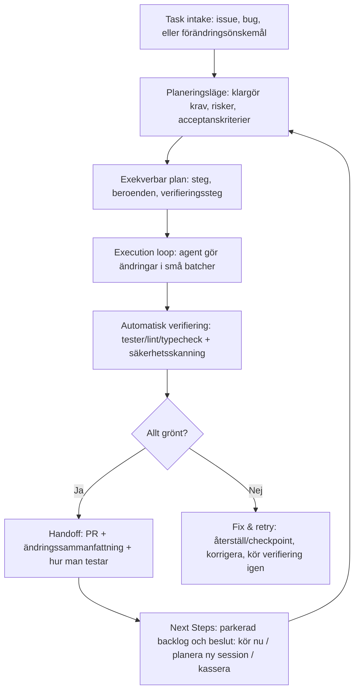

# Användarsmärtor kring planering och uppföljning i utvecklaragenter

## Omfattning och definitioner

Den här rapporten fokuserar på användarsmärtor (pain points) som uppstår när människor arbetar med **utvecklaragenter** – dvs. AI‑system som inte bara föreslår kod utan också kan planera och genomföra fler-stegsarbete via verktyg (läsa/skriva filer, köra kommandon, skapa PR:er, integrera med trackers/CI). I praktiken sträcker sig detta från terminal/CLI‑agenter (t.ex. Claude Code) till “cloud agents” som arbetar asynkront och lämnar ett granskningsbart resultat (t.ex. Copilot coding agent) samt webbaserade “agent IDEs” (t.ex. Replit Agent). citeturn1search14turn3search0turn1search10turn14view0

Rapportens kärna är två moment i agentarbetet:

- **Planering**: att bryta ned mål, tydliggöra instruktioner, prioritera, schemalägga, definiera acceptanskriterier och skapa en exekverbar plan som agenten följer. citeturn1search2turn23search5turn24view0  
- **Uppföljning**: att efter genomförande kunna förstå vad som gjorts, verifiera/testa, hantera fel och retries, göra handoff till människor (PR‑review, QA, PM), fånga “nästa steg”, och fortsätta från samma kontext utan att börja om. citeturn3search0turn21search6turn25search1turn26view0

### Vilka agenter och ramverk som ingår

Eftersom inga organisationsspecifika begränsningar angavs ingår:

- **Claude Code** (CLI/IDE/desktop/web) från entity["company","Anthropic","ai lab company"]. citeturn1search14turn1search11turn1search0turn1search15  
- **GitHub Copilot Chat** (IDE‑chat, edit/agent modes; samt relaterade agentfunktioner i GitHub/CLI) från entity["company","GitHub","code hosting company"] (ägt av entity["company","Microsoft","technology company"]). citeturn3search0turn1search5turn2search11turn3search12turn23search5  
- **Replit Ghostwriter** (historiskt namn) och den nuvarande agentiska produkten **Replit Agent** i entity["company","Replit","cloud development company"]. citeturn1search10turn1search2turn7search4turn0search24  
- **Öppna agentramverk/opensource** som används för att bygga utvecklaragenter: LangGraph (LangChain), AutoGen, CrewAI, OpenHands (f.k.a. OpenDevin), SWE‑agent. citeturn4search4turn4search27turn4search16turn14view0turn5search0

### Roller, kontexter och plattformar

Rapporten analyserar smärtor för fyra återkommande roller:  
**utvecklare** (produktivitets- och kvalitetstryck), **team leads/tech leads** (samordning, risk, standarder), **produktchefer** (scope/acceptanskriterier, spårbarhet), **QA** (reproducerbarhet, testbarhet, regressionsrisk). citeturn3search0turn18view0turn12view1

Kontexter som särskilt påverkar planering/uppföljning:

- **Lokal utveckling** (IDE/terminal) där agenten konkurrerar om uppmärksamhet med pågående arbete och där snabb iteration är viktig. citeturn1search14turn23search5  
- **CI/CD** där agentens ändringar måste valideras av pipeline‑signaler (tester, lint, policy). citeturn6search1turn21search21turn3search0  
- **Pair programming** (människa‑AI) där dialogens kvalitet och “kritisk granskning” av AI‑förslag blir avgörande. citeturn15view0turn18view0  
- **Code review** där handoff (PR‑beskrivning, diff‑förståelse, next steps) och verifiering dominerar tiden. citeturn3search0turn21search6turn12view1

Plattformar/snitt som jämförs: **IDE‑plugins** (VS Code/Visual Studio m.fl.), **webb‑konsoler** (GitHub Agents‑vy, Claude Code web, Replit workspace), **CLI** (Claude Code, Copilot CLI). citeturn1search14turn3search16turn7search26turn1search16turn23search5

## Metod och källbas

Analysen bygger på en triangulering av:

Primärkällor (prioriterade): officiell produktdokumentation och referenser för Claude Code (sessions, minne, säkerhet, hooks/MCP), GitHub Copilot (custom instructions, agent sessions/loggar, agentic memory, hooks, coding agent), och Replit Agent (plan/build mode, message queue, checkpoints/rollbacks, integritetsinställningar). citeturn1search15turn6search0turn21search3turn3search0turn22search2turn7search4turn25search1turn7search1

Community‑diskussioner: GitHub‑issues/feature requests, Reddit‑trådar och entity["organization","Hacker News","tech news forum"]‑diskussioner som uttrycker friktion i planering och uppföljning (context loss, loopar, prompt‑köer, “next steps”, mm). citeturn26view0turn2search4turn2search1turn3search30turn24view0

Akademisk och empirisk evidens: studier om agentkonfigurationsfiler (Claude.md/manifest), human‑AI pair programming (tillit/kritisk granskning), agentplattformar/observability och säkerhet (prompt injection/hijacking), samt industrirapporter om verifieringsflaskhalsen (“verification debt”). citeturn19view0turn20view0turn15view0turn6academia24turn6academia25turn12view1turn14view2

Begränsningar: Funktionalitet och UX i dessa produkter förändras snabbt; vissa community‑källor är selektiva (missnöjda användare postar mer), och observationer om frekvens/impact i denna rapport är därför **kvalitativa** (High/Medium/Low) snarare än exakta prevalenstal – utom där primärkällor ger kvantitativa resultat (t.ex. Sonar‑rapporten). citeturn12view0turn12view1

## Sammanfattning för beslutsfattare

Den mest framträdande strukturella smärtan är att **planering och uppföljning ofta saknar en stabil, explicit artefakt** som både agent och människa kan referera till över tid (exekverbar plan, parkerad backlog/“next steps”, acceptanskriterier, testchecklista). När användare försöker “stoppa in allt” i planen försämras agentens fokus, och när de inte gör det tappar de idéer och kontext. Detta uttrycks explicit i ett Claude Code‑feature request om att separera “execute now” från “revisit later”. citeturn26view0

Nästa stora smärta är **verifierings- och granskningsbördan efter agentens leverans**. En konkret indikator är att en stor majoritet av utvecklare inte litar fullt på AI‑genererad kod, och att en betydande andel inte alltid verifierar innan commit – vilket skapar en “verification bottleneck”/“verification debt”. citeturn12view0turn12view1turn9search2

Tredje kärnfriktionen är **kontextkontinuitet**: användare tappar planens/motiveringens tråd mellan sessioner, plattformar (IDE ↔ web ↔ CLI) och agentlägen, eller upplever att agenten “glömmer” projektregler. Detta syns både som klagomål (“no persistent context”) och som att leverantörer inför minnesfunktioner och instruktionfiler för att kompensera. citeturn2search4turn1search15turn22search2turn3search2turn2search11

Över flera system återkommer dessutom två riskmönster:

- **Kvalitetsrisk via över-tillit** i pair‑programming: studier pekar på att användare tenderar att lita mer på AI‑förslag och därmed granska mindre kritiskt, vilket flyttar risk till uppföljningssteget (review/test). citeturn15view0turn5search19  
- **Säkerhetsrisk via agent‑autonomi och verktygsytan**: prompt injection och tool‑hijacking är ett aktivt forskningsområde, särskilt när agenter kan köra kommandon och använda plugins/skills/MCP‑servrar; både leverantörsdokumentation och säkerhetsforskning betonar behovet av explicit godkännande, sandboxing och policy‑hooks. citeturn6search0turn6search10turn6academia24turn6academia25turn23search2

## Resultat: smärtpunkter per forskningsdimension

Nedan sammanfattas återkommande smärtpunkter kopplade till planering och uppföljning. Bedömningen **Frekvens** och **Påverkan** (High/Medium/Low) är kvalitativ och baseras på hur ofta temat återkommer i primär- och communitykällor samt hur direkt det påverkar leverans/risksänkning. citeturn12view1turn26view0turn2search4turn2search1

| Dimension | Typiska smärtpunkter (planering/uppföljning) | Konkreta exempel & korta citat | Frekvens / Påverkan | Troliga rotorsaker |
|---|---|---|---|---|
| Task decomposition & instruktionstydlighet | Svårt att veta “hur explicit” man måste vara; agenten väljer fel scope, överkomplicerar, eller missar dolda krav. Team måste ofta skriva och underhålla instruktionfiler (CLAUDE.md, copilot-instructions) – men dessa artefakter i sig är ett nytt arbete. citeturn24view0turn3search2turn1search15turn18view0 | HN‑råd: “**Be uncomfortably explicit in prompts**” och bryt ned mer än det känns nödvändigt. citeturn24view0 Empiriskt: brist på “comprehensive and accessible documentation” för manifest gör konfiguration svår. citeturn19view0 | High / High | (a) LLM‑osäkerhet vid tvetydighet; (b) agentens plan saknar formell semantik och valideras sällan mot acceptanskriterier; (c) konfigurationsfiler/instruktioner har låg standardisering och kräver egen informationsarkitektur. citeturn19view0turn20view0turn1search15 |
| Task scheduling & prioritering | Agenten saknar ofta “parking lot/icebox”-mekanism: följdidéer blandas in i exekveringen och försämrar fokus; svårt att styra vad som ska göras nu vs senare. citeturn26view0turn7search4turn3search1 | Claude Code‑feature request: “**no way to capture these items separately from the core plan**”. citeturn26view0 Replit Message Queue schemalägger uppföljningsuppgifter medan agenten jobbar. citeturn7search4 Copilot CLI stödjer att köa/styra följdmeddelanden. citeturn3search1turn3search5 | High / High | (a) Planer uttrycks som text utan exekveringspolicy (“skip”, “defer”, “blocked”); (b) UX prioriterar linjär chat framför arbetskö/backlog; (c) brist på förstaklass‑begrepp för beroenden, prioritet och deferred intent (utom i vissa nyare “task”-system). citeturn26view0turn7search4turn1search16 |
| State persistence & kontextkontinuitet | Uppföljning blir dyr när kontext försvinner mellan chat‑trådar, verktyg och dagar; användare tvingas repetera bakgrund, decisions och teststeg. citeturn2search4turn1search5turn1search0turn25search1 | Reddit: “**has no persistent context** … Every session wipes the chat history.” citeturn2search4 Claude Code kan återuppta sessioner och har persistent minne (auto memory + CLAUDE.md). citeturn1search0turn1search15 GitHub lanserar “Copilot Memory” (agentic memory) i preview. citeturn22search2turn22search0 Replit rollbacks återställer även AI‑kontext. citeturn25search1 | High / High | (a) Kontextfönster + sammanfattningar ger drift; (b) “minne” är produktspecifikt och ofta opt‑in; (c) kontext lagras i olika lager (chat‑historik, repo‑instruktioner, agentic memory) som användare måste förstå/underhålla. citeturn1search5turn22search0turn1search15turn8search1 |
| Observability & progress reporting | Svårt att se vad agenten gör, varför den väljer en väg, och om den är “klar”. Begränsad insyn gör uppföljning (review/debug) långsam och ökar risk för att fel passerar. citeturn3search16turn21search6turn25search3 | Copilot coding agent erbjuder session logs och statusvy. citeturn1search34turn3search16 Claude Code visar diff‑vy och kan visa CI‑status i session. citeturn21search6turn21search21 Replit checkpoints ger stegvis spårning och återställning. citeturn25search3turn25search1 | Medium‑High / High | (a) Agenters interna loopar är svåra att presentera begripligt; (b) plattformsfragmentering (IDE vs web vs CLI) ger ojämn telemetri; (c) brist på standardiserade “trace events” som kan kopplas till uppgifter/acceptanskriterier. citeturn14view1turn3search16turn21search21 |
| Verifiering & testning av output | Den största praktiska kostnaden flyttas ofta till “verify”: tester saknas eller körs inte, och kod som ser korrekt ut kan vara semantiskt fel. Detta gör uppföljningssteget till flaskhals. citeturn12view0turn6search8turn24view0turn14view2 | Sonar: 96% litar inte fullt på AI‑kod; bara 48% “always check” innan commit. citeturn12view0turn12view1 GitHub varnar att Copilot Chat kan se korrekt ut men vara fel och bör testas. citeturn6search8 HN‑råd: “**Always get it to generate unit tests (and run them immediately)**”. citeturn24view0 OpenHands beskriver integrationstester och result verification för agentutveckling. citeturn14view2 | High / High | (a) Agenten optimerar för plausibilitet, inte bevisad korrekthet; (b) CI/testkommandon är ofta okända/otillgängliga utan repo‑instruktioner; (c) UX belönar snabb generering mer än verifierad leverans; (d) människor kan bli mindre kritiska i human‑AI‑par. citeturn6search8turn12view1turn15view0turn3search26 |
| Handoff till människor (review/QA/PM) | Efter “done” saknas ofta ett strukturerat handoff‑paket: vad ändrades, varför, hur testar vi, vilka risker återstår, och vad är nästa steg. Resultat: fler uppföljningsrundor och osäker acceptans. citeturn3search0turn21search6turn26view0turn18view0 | Copilot coding agent skapar PR och ber om review; feedback sker via PR‑kommentarer och agenten itererar. citeturn3search0 VS Code beskriver “handoffs” mellan specialiserade agenter (plan → implementation → reviewer). citeturn23search11 Claude Code‑önskemål om “Next Steps” pekar på bristande handoff till framtida arbete. citeturn26view0 | Medium / High | (a) Agenten saknar standardiserad “definition of done” kopplad till PR‑mallar/QA‑checklistor; (b) sammanfattningar är ofta textblock utan spårbarhet till plan/commits/tests; (c) intressenter utanför IDE saknar “rätt vy”. citeturn3search0turn21search6turn23search5 |
| Felhantering & retries | Agenter fastnar i loopar, tappar delresultat vid fel, eller kräver manuell repetition. Uppföljning blir “debugging av agenten” istället för av koden. citeturn2search1turn2search24turn25search1turn7search25 | Replit‑användare: “**can’t follow through unless I repeat** … and test it over and over.” citeturn2search1 Copilot Chat‑klagan: vid misslyckad request rensas delsvaret (“loss of useful generated code”). citeturn2search24 Replit rollbacks/checkpoints används som återställningsmekanism. citeturn25search1turn25search17 | High / Medium‑High | (a) Icke-determinism och begränsad självdetektion av “stuck”; (b) brist på robust “partial output preservation”; (c) svaga återhämtningsprotokoll (retry/backoff/rollback) i UX; (d) kontextdrift gör att agenten återupprepar fel. citeturn2search24turn2search1turn25search1 |
| Säkerhet & integritet | Planering/uppföljning krockar med säkerhet: fler verktyg, mer kontext och mer automation ökar attackytan (prompt injection, tool hijacking, skills/plugins). Samtidigt blir godkännandeflöden tröttande. citeturn6search0turn6search12turn6academia24turn6academia25turn7search1 | Claude Code: användaren ansvarar och måste granska föreslagna kommandon/kod; skydd mot prompt injection beskrivs, och sandboxing/permissions finns. citeturn6search0turn6search10turn6search12 Copilot coding agent: sandbox‑miljö, read-only repo, branch‑begränsning och säkerhetsskanning (CodeQL, secret scanning, dependency checks). citeturn6search1 Replit: olika privacy‑inställningar (t.ex. OpenRouter) och Enterprise ZDR‑krav. citeturn7search1 Forskning visar sårbarhet för indirekt prompt injection och tool‑hijacking. citeturn6academia24turn6academia25 | Medium‑High / High | (a) Agenters verktygsförmåga gör “data becomes instructions”‑problemet akut; (b) användare taperar godkännanden (“approval fatigue”); (c) tredjeparts‑skills/MCP/plugins saknar ofta supply‑chain‑härdning; (d) minnesfunktioner kan lagra känslig kontext om governance saknas. citeturn6search12turn6academia25turn6search9turn22search0 |
| Verktygsintegrationer (trackers, CI, code review) | Integrationsvärdet är högt men skapar ny friktion i planering: autentisering, rätt scope, och att agenten faktiskt använder datan korrekt. Uppföljning kräver spårbarhet mellan issue ↔ plan ↔ commit/PR ↔ CI. citeturn21search3turn3search0turn7search5turn0search27 | Claude Code MCP: exempel uttryckligen på att implementera features från issue trackers och skapa PR. citeturn21search3 Copilot coding agent tar uppgifter från Issues/PR‑kommentarer. citeturn3search0turn3search22 Replit connectors: t.ex. Linear/Notion‑integrationer via OAuth. citeturn7search5 VS Code: verktygspicker och MCP‑verktyg med tak (max 128 tools/request) påverkar planering. citeturn23search17 | Medium / Medium‑High | (a) Kontextinjicering är skör (fel fil, fel issue, fel branch); (b) verktygslistor/behörigheter varierar mellan plattformar; (c) agenters “tool routing” är ofta implicit vilket försvårar debugging av integrationer. citeturn23search17turn0search27turn21search11turn21search3 |
| UX för uppföljning (nästa steg, köer, resume) | Uppföljning lider när UI inte stödjer: köade instruktioner, redigering innan sändning, “next steps”‑lista, samt enkel resume/fork med bibehållen kontext. citeturn26view0turn7search4turn3search30turn1search0turn1search11 | GitHub issue om prompt‑kö för Copilot: behov av att köa följdprompter. citeturn3search30 Replit Message Queue: uppföljning som exekveras efter varje “work loop completion”. citeturn7search4 Claude Code: web↔terminal handoff är “one-way”. citeturn1search11 Copilot Chat: rekommenderar trådar och att hålla historik relevant. citeturn1search5turn1search20 | High / Medium‑High | (a) Chatparadigmet saknar arbetsflödesprimtiver (backlog, parkeringsyta, dependency graph); (b) session- och minnesmodeller är svåra att “explain” i UI; (c) återkommande context compaction/summarization påverkar fortsättningsfrågor. citeturn1search5turn26view0turn8search1 |

## Rekommendationer

Rekommendationerna nedan är formulerade som **design/UX‑förbättringar** och **processförbättringar**. De är prioriterade utifrån att reducera uppföljningskostnad (“verification bottleneck”), minska kontextförlust, och skapa tydlig separation mellan “gör nu” och “gör sen”. citeturn12view1turn26view0turn22search2turn7search4

### Prioriterade åtgärder

**Prioritet kritisk (bör göras först)**

- Inför en förstaklass‑artefakt för **Plan + Acceptanskriterier + Verifieringsplan** (t.ex. `PLAN.md` eller UI‑panel) som agenten måste “kompilera” innan exekvering och som kan kopplas till session/loggar/PR. Detta angriper att planering annars blir text utan semantik och att uppföljning blir dyr. citeturn26view0turn3search26turn21search21turn25search8  
- Gör **“Next Steps / Parking Lot”** till en explicit del av planflödet, separerad från exekveringskärnan (deferred intent), precis som användare efterfrågar. Låt agenten presentera dessa efter “core plan complete” och erbjuda “starta ny plan” per item. citeturn26view0  
- Etablera ett standardiserat **Definition‑of‑Done‑paket** vid slutförande: (1) ändringssammanfattning per fil, (2) hur man testar, (3) vilka CI‑checks som körts/inte körts och resultat, (4) kända risker/antaganden, (5) rekommenderade nästa steg. Detta minskar review/QA‑friktion. citeturn21search21turn3search0turn12view1turn25search8  
- Bygg in **automatiserad verifiering som default** (kör test/lint/typecheck via hooks eller agentens “finish hook”) och blockera PR‑handoff om verifiering saknas eller fallerar, om inte användaren explicit väljer “skip”. Detta adresserar verifieringsgap och “approval fatigue” genom att flytta granskning till maskinbar policy. citeturn23search2turn23search4turn6search8turn12view1

**Prioritet hög**

- Stöd **prompt‑kö och message steering** konsekvent i alla ytor (IDE, CLI, web) med möjlighet att redigera köade meddelanden samt att se kontext (fil/linje) kopplad till köade instruktioner. Detta finns redan som riktning i flera system men behöver UX‑mognad. citeturn7search4turn3search30turn3search1turn3search15  
- Standardisera **session-resume/fork** som en produktförmåga med tydlig mental modell: “resume same thread”, “fork new branch from state”, “handoff between web/local”. Särskilt viktigt när plattformar har asymmetrier (t.ex. one‑way handoff). citeturn1search0turn1search11turn1search4  
- Gör minneslager explicit: **ephemeral context**, **repo‑instruktioner** (t.ex. `.github/copilot-instructions.md`, `CLAUDE.md`), och **agentic memory** (opt‑in) – med UI för inspektion/curation, så att användare förstår varför agenten “gör som den gör”. citeturn1search15turn3search2turn22search0turn22search1  
- Förbättra observability med “trace‑vy”: visa verktygsanrop, vilka filer som lästs/skrivits, vilka kommandon som körts, och vilka signaler agenten baserade beslut på (t.ex. CI‑fel). Detta finns i vissa system men behöver göras till standard. citeturn1search34turn21search21turn14view1turn25search3

**Prioritet medel**

- Inför “safe retries”: om agenten misslyckas, spara delresultat, föreslå rollback/checkpoint, och återuppta från sista verifierade delsteg – istället för att användaren upprepar hela prompten. citeturn2search24turn25search1turn7search25  
- Säkerhetshärda plugin/skills/MCP‑ekosystem: signering/attestation av skills, inventory (“AI Bill of Materials”), och policy‑hooks som kan blockera farliga tool calls utan att förlita sig på varningar som kan klickas bort. citeturn6search9turn6search21turn6academia25turn23search2  
- För team: inför agent‑anpassade issue‑mallar (väl‑scopade tasks, reproduktionssteg, testkommandon) och håll instruktionfiler levande (kodstandard, build/test, do‑not‑dos). Empiriska studier pekar på att agentbeteende och effektivitet beror starkt på dessa artefakter. citeturn20view0turn19view0turn3search26turn3search2

### Rekommenderad referensprocess (plan → utför → verifiera → handoff → uppföljning)

Flödet ovan sammanfogar: (a) explicit plan/“next steps”-behov, (b) PR‑baserad handoff och session‑loggar, (c) hooks för verifiering, och (d) checkpoint/rollback för säker återhämtning. citeturn26view0turn3search0turn1search34turn23search2turn25search1turn21search21

## Bilagor: jämförelse, intervjufrågor och mätetal

**Jämförelsetabell: stöd för planering och uppföljning**

Tolkning: **Ja** = finns som produktfunktion, **Delvis** = finns men är begränsat/kräver konfiguration, **Byggbart** = ramverk som kan byggas till, **Nej** = saknas. (Observera att ekosystem kan förändras snabbt.) citeturn1search14turn3search0turn1search10turn4search4turn14view0

| System | Planeringsläge / plan‑artefakt | Köa uppföljning (queue/steering) | Persistent kontext (resume/memory) | Observability (loggar/diff/trace) | Verifiering & testing‑koppling | Handoff (PR/review‑loop) | Integrationsyta |
|---|---|---|---|---|---|---|---|
| Claude Code | Delvis (planering via workflow; behov av “Next Steps” efterfrågas) citeturn26view0turn1search3 | Delvis (via sessions/hacks; ej förstaklass “next steps”) citeturn26view0turn1search0 | Ja (session resume; persistent memory) citeturn1search0turn1search15 | Ja (diff view, CI‑status i session) citeturn21search6turn21search21 | Delvis (hooks/sandbox/permissions; beror på repo‑kommandon) citeturn1search26turn6search12 | Delvis (PR‑flöden i web/desktop; vissa begränsningar) citeturn21search6turn21search10 | Ja (MCP + CI/CD + GitHub Actions) citeturn21search3turn21search4 |
| GitHub Copilot Chat | Delvis (custom instructions/prompt files; planering mer “promptad”) citeturn3search2turn2search11 | Delvis (trådar/follow-ups; UX‑behov av kö finns) citeturn1search20turn3search30 | Delvis (chat history; agentic memory i preview för vissa ytor) citeturn1search5turn22search2 | Delvis (IDE‑vy; varierar per miljö) citeturn3search3turn2search3 | Delvis (uppmanar review/test; ej alltid automatiskt) citeturn6search8turn2search7 | Nej/Delvis (chat kan stötta PR‑diskussion men är inte alltid en PR‑skapande agent) citeturn1search1turn1search20 | IDE‑integration + repo‑kontext (workspace) citeturn0search15turn1search9 |
| GitHub Copilot coding agent | Delvis (bäst för väl‑scopade tasks; instruktionfiler) citeturn3search0turn3search26 | Delvis (styrning via agents tab/kommentarer) citeturn3search16turn3search0 | Delvis (sessions + Copilot Memory) citeturn1search34turn22search0 | Ja (session logs, status) citeturn1search34turn3search16 | Ja (inbyggd security validation; CI‑koppling via Actions) citeturn6search1turn3search0 | Ja (PR + review‑iteration) citeturn3search0 | GitHub Issues/PR + MCP + Actions citeturn3search0turn3search22 |
| GitHub Copilot CLI | Delvis (plan‑before‑build riktning; hooks/skills) citeturn1search16turn23search13 | Ja (enqueue/steer) citeturn3search5turn3search1 | Delvis (resume sessions; agentic memory) citeturn1search16turn22search23 | Delvis (CLI‑loggar; hooks kan logga) citeturn23search0turn23search24 | Delvis (hooks kan köra tester) citeturn23search13turn23search24 | Delvis (kan dra cloud session lokal) citeturn1search16 | CLI + ACP + MCP citeturn23search21turn23search17 |
| Replit Agent (Ghostwriter‑ekosystem) | Ja (Plan Mode + Build Mode) citeturn1search2turn1search6 | Ja (Message Queue) citeturn7search4turn7search11 | Ja (checkpoints/rollbacks inkl. AI‑kontext) citeturn25search1turn25search0 | Ja (checkpoints, diff/preview) citeturn25search3turn25search6 | Delvis (guides + scanner; beror på hur man arbetsleder) citeturn7search8turn25search8 | Delvis (mer IDE‑centriskt än PR‑centriskt) citeturn25search3turn7search26 | Integrations/connectors (Linear/Notion etc) citeturn7search5turn25search8 |
| OpenHands (open source) | Byggbart (inkl. planning‑agent‑arbete i projektet) citeturn4search17turn14view0 | Byggbart | Byggbart (event stream/state) citeturn14view1 | Ja/Byggbart (UI visar actions/observations) citeturn14view0turn14view2 | Byggbart (integration tests för agenter) citeturn14view2 | Byggbart | Sandbox + terminal + web + API citeturn14view1turn4search21 |
| LangGraph (ramverk) | Byggbart (graph‑baserad plan/orkestrering) citeturn4search4 | Byggbart | Ja/Byggbart (persistence via checkpointers; thread_id) citeturn4search4turn4search0 | Byggbart (traces via execution steps/checkpoints) citeturn4search4 | Byggbart (HITL + interrupts för godkännande) citeturn4search0turn4search30 | Byggbart | Tooling via integrationer (MCP/SDKs) citeturn4search0turn23search17 |
| CrewAI (ramverk) | Byggbart (planning feature + processes) citeturn4search16turn4search6 | Byggbart | Delvis/Byggbart (memory extraction/recall) citeturn4search2turn4search28 | Byggbart | Byggbart | Byggbart | Ekosystem beroende (verktyg/memory‑stores) citeturn4search2turn4search37 |
| AutoGen (ramverk) | Byggbart (conversation patterns; save/load state i diskussioner) citeturn4search19turn4search27 | Byggbart | Delvis/Byggbart (save_state/load_state i vissa API:er) citeturn4search27 | Byggbart | Byggbart | Byggbart | Tool‑calling och deployment‑mönster citeturn4search10turn4search19 |
| SWE‑agent (open source) | Delvis (issue‑till‑PR‑mönster men kräver bra issue‑spec) citeturn5search0turn5search14 | Byggbart | Byggbart | Delvis | Delvis (benchmarks/test‑harness) citeturn5search14turn5search26 | Delvis (GitHub‑issue→patch) citeturn5search0 | GitHub‑centriskt citeturn5search0 |

**Intervju- och enkätfrågor för att validera fynden**

Följande frågor är utformade för att testa hypoteserna i rapporten (planeringskvalitet, uppföljningsfriktion, verifieringsbörda, kontextkontinuitet, säkerhetskänsla). De kan ställas per roll (dev, lead, PM, QA) och per kontext (lokalt, CI/CD, pair, code review). citeturn12view1turn26view0turn15view0turn23search2turn25search1

1. När du ger agenten en uppgift: vad är den vanligaste orsaken till att du måste omformulera planen innan du vågar köra?  
2. Hur ofta uppstår “scope creep” där agenten gör mer (eller annat) än du tänkt – och vad triggar det?  
3. Vilka delar av en bra plan saknar du mest (acceptanskriterier, beroenden, teststeg, risker, “next steps”)?  
4. Hur hanterar du följdidéer under planering idag (extern anteckning, i samma plan, ny session, kö/queue)?  
5. Hur ofta tappar du kontext mellan sessioner/verktyg? Vad behöver du repetera?  
6. Vilka artefakter använder du för att “minnas” (instruktionfiler, tickets, design docs, chat‑historik, agentic memory)?  
7. Hur ofta kör agenten tester/lint själv – och hur ofta gör du det manuellt efteråt?  
8. Har du exempel där agenten gav “snygg men fel” kod? Hur upptäcktes felet?  
9. Vid code review: vad saknas oftast i agentens handoff (varför, hur testa, risk, förändringslista, metrics)?  
10. Har du upplevt agent‑loopar (repetitiv fix‑fail)? Hur bröt du loopen (rollback, ny chat, mer kontext, mindre scope)?  
11. Hur upplever du godkännandeflöden för kommandon/verktyg (för många prompts → klicktrötthet, eller för få → otrygghet)?  
12. Vilken integrationspunkt ger mest värde (issue tracker, CI, code review, observability, design tools) – och vilken skapar mest friktion?  
13. Om du fick en “Next Steps”-lista efter varje körning: hur skulle du vilja triagera den (prioritet, ny plan, assign till människa/agent)?  
14. För leads/PM: vad behöver du se för att acceptera agentarbete (spårbarhet, risk, testbevis, policy‑status)?  
15. För QA: vilka signaler (testloggar, reproduktionssteg, ändringssammanfattning) skulle minska din tid per agent‑PR?

**Rekommenderade mätetal att följa (produkt- eller teamnivå)**

Metrikerna nedan är valda för att kvantifiera just planering/uppföljning, inte “kodrader per timme”. De kan samlas via agentloggar, PR‑data, CI och enkätpulser. citeturn12view1turn3search16turn21search17turn25search3turn23search2

- **Plan‑kvalitet**: andel uppgifter där planen behövde omarbetas >1 gång innan exekvering; andel där “next steps” överstiger X% av planens storlek (tecken på scope‑drift). citeturn26view0  
- **Uppföljningsfriktion**: median antal uppföljningsprompter/iterationer per uppgift (inkl. PR‑kommentarer) tills acceptans/merge. citeturn3search0turn7search4  
- **Verifieringsgrad**: andel agentleveranser där test/lint/typecheck körts och passerat innan handoff; samt tid från “agent done” till “verification done”. citeturn23search2turn21search21turn12view1  
- **Regression/återarbete**: återöppnade PR:er, regressionsbuggar inom N dagar efter merge av agentarbete (kontrollerat för area/komplexitet). citeturn12view1turn9search13  
- **Kontextkontinuitet**: andel sessioner som återupptas (resume) vs startas “new”; antal gånger instruktionfiler uppdateras per månad; antal “summarization/compaction events” per lång uppgift. citeturn1search0turn1search15turn1search5turn8search1  
- **Observability‑coverage**: andel uppgifter där full session log/diff/trace finns och länkas till PR/issue; tid att lokalisera “vad agenten gjorde” i efterhand. citeturn1search34turn21search6turn14view1  
- **Felåterhämtning**: loop‑indikatorer (≥K repetitiva felcykler), rollback‑frekvens, tid till recovery efter failure. citeturn2search1turn25search1turn7search25  
- **Säkerhetspostur**: antal policy‑blockerade tool calls via hooks; antal aktiva MCP/skills; incidenter/near-misses relaterade till prompt injection eller felaktig tool‑användning. citeturn23search2turn6academia25turn6search9